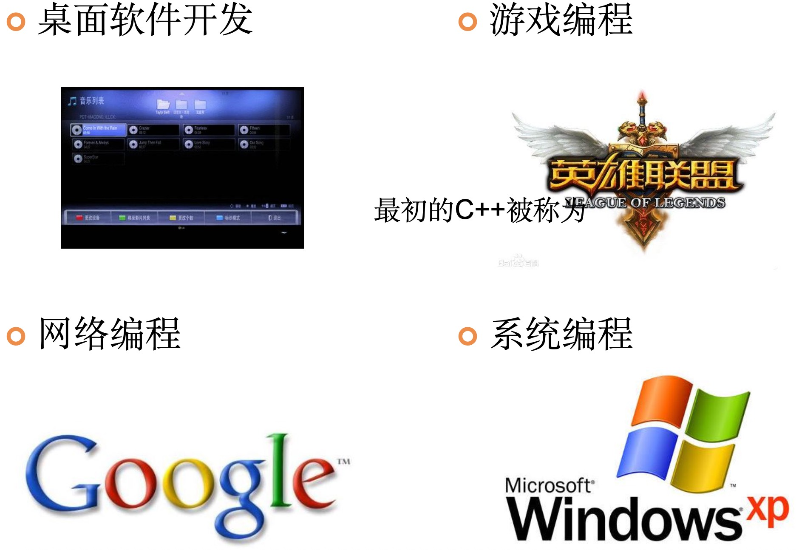
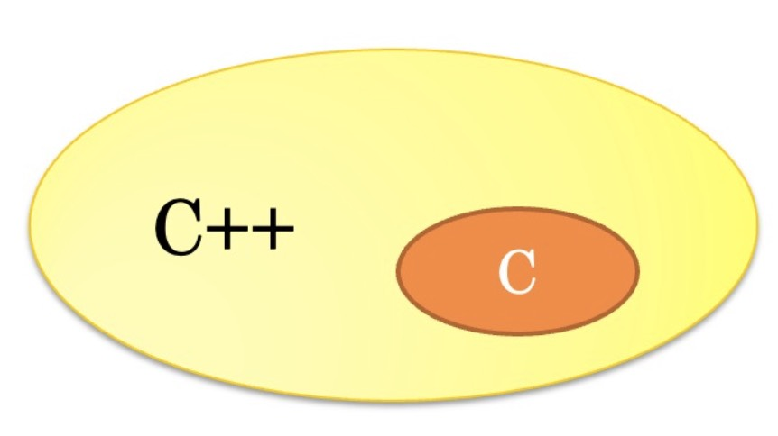
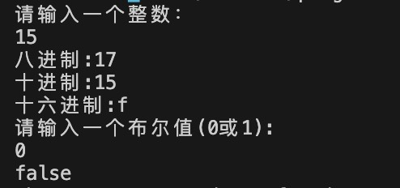
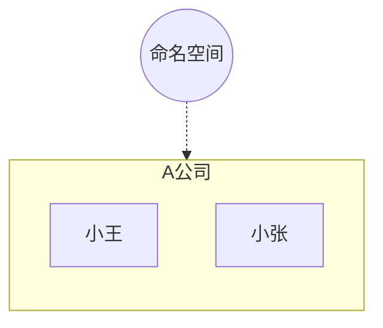
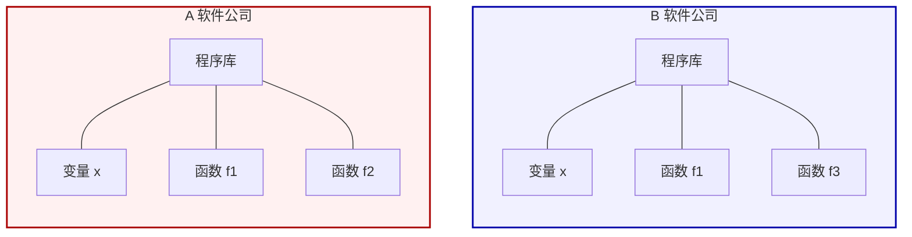
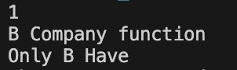

# C++教程起航篇

我们会讲C++那些事，C++与C语言的关系。

> C++诞生于贝尔实验室。  
> C++之父: 本贾尼·斯特劳斯特卢普

C++社区排行榜


C++语言的应用领域:



快，省

## C与C++的关系

C语言是C++的子集。



C++在语法上完全兼容C，C++是从C的基础上发展而来的。

- C语言是面向过程的语言，而C++是面向过程的语言又是面向对象的语言。
- C语言的运行效率比c++更好。

学习C++，基础是学习C语言

## C++ IDE环境搭建

我的IDE 与 IDE初体验

> Q: 什么是IDE环境？  
> A: IDE: Integrated Development Environment, 集成开发环境，
> 一般包括代码编辑器，编译器，调试器和图形用户界面工具。

<details>

<summary>Windows 下环境搭建的步骤</summary>

iso文件，虚拟光驱，找到setup.exe.

Visual Studio 2022 + Visual Assist X

因为我们学习c++，可以只安装C++部分。

- 如何新建项目

>新建项目 -> 选择Visual C++ -> win32控制台应用程序


选择空文件，理解程序从无到有。

- 如何新建文件


源文件上点击右键添加新建项。

新建时选择cpp文件。

- 如何设置字体字号(工具->选项->字体和颜色)

</details>

<details>

<summary>macOS 下的环境搭建步骤</summary>

在 App Store 中搜索 `Xcode`，获取并安装。  


安装完毕后打开 Xcode，会提示安装工具链，仅勾选电脑的工具链即可。

</details>

## C++之初体验

那么就让我们驶出远征中的第一步->Hello C++

```c++
#include <iostream>
using namespace std;    //关于这里，且听下回分解
int main()
{
   cout << "Hello C++";  //在此填写我们的开篇Hello C++
   return 0;
}
```
## C++的新特性

### C++基本知识

新的数据类型，新的初始化方法，随用随定义的特性。

C语言中的数据类型：

类型关键词|字节大小 (典型值)
-|-
`char`|1 Byte
`unsigned char`|1 Byte
`int`|4 Bytes
`unsigned int`|4 Bytes
`short`|2 Bytes
`long`|4/8 Bytes
`float`|4 Bytes
`double`|8 Bytes

1. c++新增bool数据类型，数值为true与false   

```cpp
#include <iostream>
using namespace std;

int main() {
    bool isRaining = true;  // true 代表真
    bool isSunny = false;   // false 代表假

    if (isRaining) {
        cout << "记得带伞！" << endl;
    }

    return 0;
}
```

>优：快捷方便，还有视觉上清晰易懂,程序易读易懂

2. c++除了拥有语言自带的初始化方式外，新增了一种定义方式(直接初始化)

C语言提供的初始化方法:   

```cpp
int x = 1024; // 赋值表示法

int x(1024); // 函数表示法

int x{1024}; // 列表初始化, C++11
```

>除了与c语言一样的复制初始化，还有自己独有的直接初始化 优点：很快捷方便
 
3. c++可**随用随定义**，而c的对变量的定义必须放置在函数体最前面

```c
// C 语言

#include <stdio.h>

int main() {
	int a = 3;
	int b = 4;

	a = a + 2;
	b = b + a;

	return 0;
}
```

```cpp
// C++

#include <stdio.h>

int main() {
	int a = 3;
	a = a + 2;

	int b = 4;
	b = b + a;

	return 0;
}
```

>c语言方式下，程序长了还得调到上面定义变量很不方便。

总结: 新的数据类型(布尔类型)，新的初始化方法(用括号括起来直接初始化)，随用随定义的特性。

### C++的输入输出方式

C语言中的 I/O 方式：
```c
// C语言：需要关注占位符

#include <stdio.h>

int main() {
    int age = 18;
    float score = 92.5f;
    char grade = 'A';

    printf("年龄: %d, 分数: %.1f, 等级: %c\n", age, score, grade);

    return 0;
}
```

C++中的 I/O 方式：

```cpp
// C++：无需关注占位符

#include <iostream>
using namespace std;

int main() {
    int age = 18;
    float score = 92.5f;
    char grade = 'A';

    cout << "年龄: " << age 
         << ", 分数: " << score 
         << ", 等级: " << grade << endl;

	// 设置宽度

    cout << "年龄: " << setw(10) << age 
         << ", 分数: " << setw(10) <<score 
         << ", 等级: " << setw(10) << grade << endl;

    return 0;
}
```

> **cout 语法形式**
> 
> 两个连续的小于号(小于号中间没有空格)，输入变量x(不需要区分类型，不需要 `%d` 等)。`endl` 和c> 语言中的 `\n` 是等效的：
> 
> ```cpp
> cout << x << endl;
> ```
> 
> ```cpp
> cout << "x+y=" << x+y << endl;
> ```
> 
> 错误示例如下：
> 
> ```cpp
> cout << x,y,z << endl;
> ```

> **cin 语法形式**
> 
> 将外界的输入传递到x。不需要关注变量x的类型，不需要c语言的格式符：
> ```cpp
> cin >> x;
> ```
> 
> cin输入方式, x y为变量. 依次为多个变量赋值：
> 
> ```cpp
> cin >> x >> y;
> ```

这样的输入输出方式有哪些便利？

- 不用关注占位符。
- 不用关注数据类型。

不容易出现问题

#### C++新特性及输入输出演示小 demo

- 八进制：oct;
- 十进制：dec;
- 十六进制：hex;
- bool类型输出：`boolalpha`;

c++中默认的i/o类型为十进制；如果不加说明，是无法辨认 `0`, `0x` 开头的八进制和十六进制的。在cin或cout中指明进制类型后，该进制将一直有效，直到再次改变它的进制。

4-C++-hexConvert/main.cpp
```c++
#include <iostream>
#include <stdlib.h> // C++中更推荐使用 <cstdlib> 而不是 <stdlib.h>
using namespace std;

int main()
{
	cout << "请输入一个整数：" << endl;
	int x = 0; // 随用随定义
	cin >> x;
	cout << "八进制:" << oct << x << endl; // 八进制
	cout << "十进制:" << dec << x << endl; // 十进制
	cout << "十六进制:" << hex << x << endl; // 十六进制

	cout << "请输入一个布尔值(0或1):"<< endl;
	bool y = false;
	cin >> y;
	cout << boolalpha << y << endl; // 布尔类型输出

	system("pause");
    return 0;
}
```

按下 F5 开始调试



### C++命名空间 (namespace)

什么是命名空间

简言之: 就是为程序划片取名字



namespace 区别来自不同的对象的相同名字的函数，为程序划片取名字。

#### 为什么要有命名空间？



A公司和B公司都有函数 `f1`，那么不指明是哪个公司的 `f1` 就会产生 “不知道要调用哪个f1” 的问题。

#### 程序中的命名空间

> Q: C公司购买了A和B的程序库，想要使用A的变量x,B公司函数f1怎么办？  
> A: A和B就要使用命名空间

命名空间关键字：`namespace`  

例如，`namespace A`,`namespace B`

```c++
namespace A{
   int x = 0;
   void f1();
   void f2();
}
namespace B{
   int x = 2;
   void f1();
   void f3();
}
```

要调用命名空间内变量或函数写法(C公司要使用的话):

```c++
// 输出A中的变量x
cout << A::x << endl;
// 使用B中的f1
B::f1();
```

#### namespace演示代码

- 正常的 `system("pause")` 包含于 `stdlib.h`

```cpp
#include <stdlib.h>

int main()
{
	system("pause");
	return 0;
}
```
- 要引用相应的头文件，还要引用对应的命名空间才可以正常运行。

1. 缺少 `#include <iostream>`  
    报错，cin cout 未声明的标识符

2. `using namespace std;`  
    依然报错, 未声明的标识符, 因为iostream 中的cin cout在命名空间当中。

```cpp
#include "stdafx.h"
#include <stdlib.h>
#include <iostream> // cin cout 步骤1

using namespace std; // 步骤2
int main()
{
	cout << "hello" << endl;
	system("pause");
	return 0;
}
```

#### 模拟A,B公司写代，C公司使用

主函数为main函数模拟c公司。

4-C++-CompanyABC/main.cpp
```cpp
#include <stdlib.h>
#include <iostream>

namespace A 
{
	int x = 1;
	void fun()
	{
		std::cout << "A Company function" << std::endl;
	}
}

namespace B
{
	int x = 2;
	void fun()
	{
		std::cout << "B Company function" << std::endl;
	}
	void fun2()
	{
		std::cout << "Only B Have" << std::endl;
	}
}

using namespace B;
int main()
{
	std::cout << A::x << std::endl;
	B::fun();
	fun2(); // using name space B; + fun2(); 等价 B::fun2();
	system("pause");
	return 0;
}
```



不写 `using namespace std` 时，想要用 `cin` 和 `cout` 的话, 使用 `std::cin` `std::cout`

#### 章节练习 (命名空间)

要求：定义一个命名空间为myNum,在该命名空间中定义一个整型变量x,并给该变量赋值为105；使用C++新特性判断myNum命名空间下的变量是奇数还是偶数。

4-9-C++-namespaceDemo/main.cpp

```cpp
#include <iostream>
#include <stdlib.h>
using namespace std;

namespace myNum           //填写命名空间的关键字
{
	int x = 105;
}

int main()
{
	// 使用bool类型定义isOdd，作为状态位
	bool   isOdd = false;

	if (myNum::x % 2 == 0)
	{
		//改变状态位的值，使其为false
		isOdd = false;
	}
	else
	{
		//改变状态位的值，使其为true
		isOdd = true;
	}
	// 判断状态位的值
	if (isOdd)
	{
		// 如果状态位的值为true，则打印变量x是奇数
		cout << myNum::x << "是奇数"<<endl;
	}
	else
	{
		// 如果状态位的值为false，则打印变量x是偶数
		cout << myNum::x << "是偶数"<<endl;
	}
	system("pause");
	return 0;
}
```

## 综合练习

知识点：bool类型 命名空间 输入输出。  
要求：使用一个函数找出一个整型数组中的最大值最小值。

5-1-c++-boolNamespaceCinCout/main.cpp  
一个函数， 传入整型数组，求最大最小值
```cpp
/********************************************************/
/*知识点：bool类型 命名空间 输入输出                      */
/*题目要求:                                             */
/*        使用一个函数找出一个整型数组中的最大值最小值。    */
/*******************************************************/
#include <stdlib.h>
#include <iostream>

namespace CompA
{
	int getMaxOrMin(int *arr, int count, bool isMax)
	// 数组，数组元素个数，最大还是最小(True 最大，False最小)
	{
		int temp = arr[0]; 
		// 先拿到整个数组中的第一个元素，一旦发现比它大的，就把刚发现的赋值给它
		for (int i = 1; i < count; i++)
		// 经典写法int i=0; i < count; 既然我们已经把第0个取了，我们可以从第一个开始比
		{
			if (isMax)
			{
				if (temp < arr[i]) {
					temp = arr[i];
				}
			}
			else
			{
				if (temp > arr[i]) {
					temp = arr[i];
				}
			}

		}

		return temp;
	}
}


int main(void)
{
	int arr1[4] = { 3,5,1,7 };
	bool isMax = false; // 与形参区别开
	std::cout << "您想要求数组{3,5,1,7}最大值还是最小值？(0最小,1最大)" << std::endl;
	std::cin >> isMax;
	std::cout << CompA::getMaxOrMin(arr1, 4, isMax) << std::endl;
	system("pause"); // stdlib.h
	return 0;
}
```


